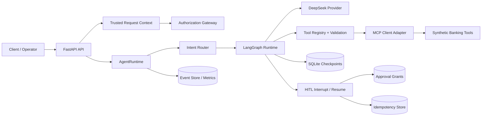

# FxFill Enterprise Banking Agent

[English](README.md) | [简体中文](README.zh-CN.md)

An enterprise-oriented banking AI agent reference implementation built with LangGraph, FastAPI, DeepSeek, MCP-style tool boundaries, deterministic authorization, Human-in-the-Loop (HITL) approval, durable state, and synthetic banking data.

> **Scope and safety:** This repository is a portfolio/reference implementation. It does not process real money, real customers, or real personal data. It is not approved for production banking use without independent security, compliance, operational, and integration review.

## Current Maturity

| Target | Current assessment |
|---|---|
| Portfolio / technical demonstration | Complete for the v0.2.0 portfolio release |
| Production-like internal prototype | Partial |
| Real banking production system | Not ready |

The project demonstrates enterprise architecture patterns, but it deliberately distinguishes **implemented**, **wired**, **tested**, **live-validated**, and **production-ready** capabilities.

## Latest Verified Evidence

Final portfolio verification completed on **2026-06-25** against commit `ad340f0`:

| Check | Result |
|---|---|
| Package version | `0.2.0` |
| Automated tests | `393 passed, 1 skipped` |
| Line coverage | `67.29%` across `src/` |
| Ruff lint | Passed |
| Ruff format check | Passed |
| MyPy | Passed for the configured scope (`89` source files) |
| Docker image build | Passed |
| Docker Compose | `agent`, `postgres`, and `redis` reached `healthy` |
| Health endpoints | `GET /health` and `GET /health/deep` returned `200` |
| Trusted identity | `user-alice` could access `ACC-1001` |
| Cross-account isolation | `user-alice` was denied access to `ACC-2001` |
| Prompt identity spoofing | Prompt-provided identity did not override trusted identity |
| Secret hygiene | `.env` is ignored and common secret patterns were not found in the local Git-history scan |

The skipped test is the opt-in live-provider test. OIDC/JWT verification is implemented and locally tested; validation against a real identity provider, including key rotation and operational deployment, remains pending.

Local verification does not replace penetration testing, compliance review, production certification, or controlled deployment.
## Verified Capabilities

- **Bounded LangGraph runtime** with explicit step limits.
- **FastAPI API** with typed request and response models.
- **DeepSeek provider integration** using an OpenAI-compatible request/response path.
- **MCP-style banking tool boundary** that prevents the model from directly accessing the repository.
- **Typed tool registry and validation** for tool names, arguments, side effects, risk, and permissions.
- **Deterministic authorization** that does not treat prompt text as permission.
- **Trusted identity injection** for identity-sensitive direct-route tools.
- **Cross-account access protection** for synthetic account data.
- **Durable SQLite state** for checkpoints, HITL sessions, grants, idempotency, and events.
- **HITL interrupt/resume path** for sensitive operations.
- **Idempotency controls** intended to prevent duplicate side effects.
- **Structured logging, metrics, and correlation components**.
- **Docker and Docker Compose packaging** with health checks.
- **Kubernetes and CI scaffolding** for productionization work.
- **Pinned read-only upstream benchmark dependency**.

## Architecture



### Trust Boundaries

1. **LLM output is untrusted.** Tool names and arguments require deterministic validation.
2. **Prompt text is not authorization.** Identity, ownership, roles, tenant, and approval authority must come from trusted context.
3. **The model cannot directly mutate banking state.** All operations cross the tool boundary.
4. **Sensitive actions require explicit policy checks and approval semantics.**
5. **Benchmark upstream code is pinned and read-only.** Gold states, answers, rewards, and evaluator internals must not be inspected.

## Synthetic Banking Tools

| Tool | Type | Purpose |
|---|---|---|
| `get_account_summary` | Read-only | Retrieve a synthetic account summary |
| `get_balance` | Read-only | Retrieve a synthetic account balance |
| `list_transactions` | Read-only | List recent synthetic transactions |
| `find_beneficiary` | Read-only | Find a synthetic beneficiary |
| `get_transfer_status` | Read-only | Check transfer-draft status |
| `create_transfer_draft` | Side effect | Create a transfer draft |
| `submit_transfer` | Side effect | Submit a transfer draft |
| `cancel_transfer` | Side effect | Cancel a pending draft |
| `report_suspicious_transaction` | Side effect | Create a synthetic suspicious-transaction report |

All accounts, beneficiaries, transactions, and transfers in this repository are synthetic.

## Quick Start

### Requirements

- Python `>=3.12,<3.14`
- `uv`
- Git
- Docker Desktop or Docker Engine for the container path
- A DeepSeek API token for the live provider path

### Install

```bash
git clone https://github.com/Tito-999/fxfill-enterprise-banking-agent.git
cd fxfill-enterprise-banking-agent
uv sync --group dev
```

Copy the example environment file and set your own token locally:

```bash
cp .env.example .env
```

Never commit `.env` or a real API token.

### Run locally

```bash
export DEEPSEEK_API_TOKEN="your-token"
export FXFILL_DATA_DIR="./data"
export PERSISTENCE_DB_PATH="./data/agent.db"

uv run python -m fxfill_banking_agent.server
```

PowerShell:

```powershell
$env:DEEPSEEK_API_TOKEN = "your-token"
$env:FXFILL_DATA_DIR = "./data"
$env:PERSISTENCE_DB_PATH = "./data/agent.db"

uv run python -m fxfill_banking_agent.server
```

### Run with Docker Compose

```bash
docker compose up -d --build
docker compose ps
curl http://127.0.0.1:8000/health
```

For Windows environments with a localhost proxy:

```powershell
curl.exe --noproxy "*" http://127.0.0.1:8000/health
```

### Query the agent

The development identity is supplied through headers. The following fixture belongs to `user-alice`:

```bash
curl --noproxy "*" \
  -X POST \
  -H "Content-Type: application/json" \
  -H "X-User-Id: user-alice" \
  -H "X-Tenant-Id: default" \
  -d '{
    "message": "What is the balance of account ACC-1001?",
    "session_id": "demo-session"
  }' \
  http://127.0.0.1:8000/agent
```

Expected synthetic result: account `ACC-1001`, balance `15000.0 USD`.

## Quality Gates

```bash
uv sync --group dev
uv run pytest
uv run pytest -q --cov=src --cov-report=term-missing
uv run ruff check .
uv run ruff format --check .
uv run mypy src
```

Current local result:

```text
393 passed, 1 skipped
67.29% line coverage
Ruff passed
Format check passed
Configured MyPy scope passed for 89 source files
```

## Repository Structure

```text
.
├── src/fxfill_banking_agent/
│   ├── agent.py
│   ├── graph.py
│   ├── api.py
│   ├── server.py
│   ├── bootstrap.py
│   ├── auth.py
│   ├── auth_middleware.py
│   ├── approval_executor.py
│   ├── checkpoint_store.py
│   ├── hitl_store.py
│   ├── grant_repo.py
│   ├── idempotency_store.py
│   ├── persistence.py
│   ├── providers/
│   ├── banking/
│   ├── mcp/
│   ├── tools/
│   ├── routing/
│   ├── orchestration/
│   ├── memory/
│   └── rag/
├── tests/
├── docs/
├── k8s/
├── .github/workflows/
├── Dockerfile
├── compose.yaml
├── SPEC.md
├── ROADMAP.md
├── UPSTREAM.lock
└── pyproject.toml
```

## Known Limitations

The following are explicit, current limitations:

1. **OIDC/JWT verification is implemented and locally tested.** Validation against a real identity provider, key rotation procedures, and production deployment remain pending.
2. **Development identity headers are not production authentication.**
3. **HITL identity binding is incomplete.** Some approval/session paths still use default identity values or parallel execution semantics.
4. **SQLite is still the verified authoritative runtime store.** PostgreSQL and Redis containers start, but are not yet the main source of truth and distributed coordination layer.
5. **Multi-replica correctness is unproven.** In-memory rate limiting and local state prevent a production-safe horizontal-scaling claim.
6. **The health endpoint is shallow.** It does not yet validate every required dependency.
7. **CORS and client error handling need production hardening.**
8. **MyPy passes with scoped `ignore_errors = true` overrides on several critical modules.**
9. **Coverage is 68%.** Several enterprise/operations modules remain at 0% or low coverage.
10. **The official `tau2-bench` `banking_knowledge` evaluation has not been completed.**
11. **The live-provider test is opt-in and skipped by default.**
12. **Kubernetes, IAM, observability, reliability, and AgentOps assets include scaffolding that is not fully wired or operated.**

See [`docs/execution/STATUS.md`](docs/execution/STATUS.md) for the detailed phase and blocker status.

## Production-Readiness Priorities

1. Implement cryptographically verified OIDC/JWT authentication.
2. Bind the trusted subject and tenant to every HITL and approval record.
3. Unify graph resume and side-effect execution into one canonical path.
4. Make PostgreSQL and Redis authoritative production dependencies.
5. Add migrations, pooling, transaction isolation, optimistic locking, and distributed idempotency.
6. Harden CORS, errors, timeouts, request limits, and health checks.
7. Remove critical-module MyPy exemptions.
8. Raise critical-path coverage and test concurrency, crashes, retries, and unknown outcomes.
9. Wire OpenTelemetry, metrics, audit export, alerts, dashboards, and runbooks.
10. Complete the official external benchmark and live-provider regression evidence.

## Benchmark Integrity

- Upstream repository: `sierra-research/tau2-bench`
- Pinned commit: recorded in `UPSTREAM.lock`
- Domain: `banking_knowledge`
- Integration mode: external, pinned, read-only
- Official evaluation: manual and outside automated coding agents
- No benchmark gold answers, reward internals, evaluator internals, or hidden states may be inspected

## Project Positioning

Accurate description:

> An enterprise-oriented, auditable banking-agent reference implementation with deterministic authorization, trusted identity propagation, HITL controls, durable local state, container packaging, and extensive automated tests.

Inaccurate description:

> A production-ready system approved to handle real banking customers and real funds.

## Documentation

- `SPEC.md` — scope and trust boundaries
- `ROADMAP.md` — phase roadmap
- `AGENTS.md` — engineering rules
- `docs/execution/STATUS.md` — current implementation status
- `docs/execution/DECISIONS.md` — architecture decisions
- `docs/execution/TEST_EVIDENCE.md` — recorded verification evidence
- `docs/execution/BASELINE_AUDIT.md` — baseline audit
