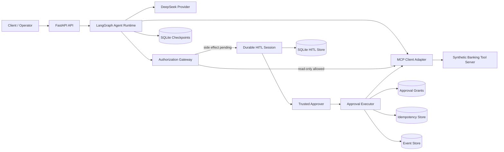

# FxFill Enterprise Banking Agent

[English](README.md) | [简体中文](README.zh-CN.md)

An auditable, production-oriented enterprise banking AI agent built with LangGraph, FastAPI, MCP-style tool boundaries, DeepSeek, and durable SQLite-backed human-in-the-loop workflows.


> This repository is a reference and portfolio implementation. It uses synthetic banking data and must not be used to process real money, real customers, or sensitive personal information without a complete security, compliance, and operational review.

## Overview

FxFill Enterprise Banking Agent demonstrates how to build a banking assistant whose reasoning is model-driven while permissions, side effects, persistence, and recovery remain deterministic and auditable.

The system can answer account questions, inspect synthetic transaction data, prepare transfer drafts, and route sensitive operations through an explicit human-approval workflow. Its core design principles are fail-closed authorization, exact-operation approval grants, idempotent execution, durable state, and strict separation between LLM reasoning and banking tools.

The repository also includes a benchmark-integration scaffold for the public `tau2-bench` `banking_knowledge` domain. The upstream benchmark is pinned and treated as read-only.

## Key Features

- **Bounded LangGraph runtime** — explicit reasoning and tool-execution loop with a hard step limit.
- **FastAPI service** — typed request and response schemas with `/health`, `/agent`, and `/agent/approve`.
- **MCP-style tool isolation** — banking capabilities are exposed through a dedicated client/server boundary.
- **Deterministic authorization** — side-effecting operations do not rely on prompt instructions for security.
- **Durable human-in-the-loop approval** — approval sessions, grants, transitions, expiry, and recovery states are stored in SQLite.
- **Exact-operation grants** — approvals are bound to the session, user, thread, tool call, canonical arguments, digest, and idempotency key.
- **Single-use and idempotent execution** — retries and repeated approvals cannot silently repeat confirmed side effects.
- **Crash and uncertainty recovery** — explicit failed, unknown, resumed, expired, and reconciliation-required outcomes.
- **Structured observability** — persistent events, provider latency and token usage, correlation metadata, and structured logging.
- **Benchmark integrity controls** — pinned upstream source, read-only integration, and manual official evaluation boundaries.
- **Quality gates** — unit and integration tests, Ruff, MyPy, and phase-based evidence reports.

## Architecture



### Trust Boundaries

1. **LLM output is untrusted.** Model-generated tool names and arguments must pass deterministic validation and authorization.
2. **Prompt text is not an authorization mechanism.** Side-effect permissions are enforced in code.
3. **The MCP boundary owns tool execution.** The model never receives direct access to the banking repository.
4. **Approval identity must be trusted.** The `approver` field in an HTTP body is treated only as untrusted input.
5. **Upstream benchmark code is external and read-only.** Runtime code must not inspect benchmark answers, rewards, evaluators, or gold state.

## Banking Tools

| Tool | Type | Purpose |
|---|---|---|
| `get_account_summary` | Read | Return account details and summary information |
| `get_balance` | Read | Return the current account balance |
| `list_transactions` | Read | List recent transactions |
| `find_beneficiary` | Read | Find a beneficiary by identifier |
| `get_transfer_status` | Read | Inspect a transfer draft or transfer state |
| `create_transfer_draft` | Side effect | Prepare a transfer without submitting it |
| `submit_transfer` | Side effect | Submit an existing transfer draft |
| `cancel_transfer` | Side effect | Cancel a pending transfer draft |
| `report_suspicious_transaction` | Side effect | Create a synthetic suspicious-activity report |

All bundled accounts, beneficiaries, transactions, and transfers are synthetic development fixtures.

## Technology Stack

| Area | Technology |
|---|---|
| Language | Python 3.12 or 3.13 |
| Agent orchestration | LangGraph, LangChain Core |
| API | FastAPI, Uvicorn, Pydantic |
| LLM provider | DeepSeek through an Anthropic-compatible HTTP API |
| Tool integration | MCP client adapter and synthetic in-process banking server |
| Persistence | SQLite, `aiosqlite` |
| Logging | `structlog` |
| Testing | Pytest, Pytest Asyncio |
| Quality | Ruff, MyPy |
| Packaging | Hatchling, `uv` |

## Repository Structure

```text
.
├── src/fxfill_banking_agent/
│   ├── agent.py                 # Agent runtime
│   ├── graph.py                 # LangGraph state graph
│   ├── api.py                   # FastAPI application factory
│   ├── bootstrap.py             # Production composition root
│   ├── auth.py                  # Authorization policies and gateway
│   ├── approval_executor.py     # Durable approval execution
│   ├── actor_resolver.py        # Trusted approver identity abstraction
│   ├── banking/                 # Synthetic banking repository and tools
│   ├── mcp/                     # MCP models and client adapter
│   ├── providers/               # LLM provider implementations
│   ├── db.py                    # Schema initialization and migrations
│   ├── checkpoint_store.py      # Durable agent checkpoints
│   ├── hitl_store.py            # Human-approval sessions
│   ├── grant_repo.py            # Exact-operation approval grants
│   ├── idempotency_store.py     # Duplicate-execution protection
│   └── persistence.py           # Durable event store
├── tests/                       # Unit and integration tests
├── scripts/run_benchmark.py     # Manual benchmark harness scaffold
├── docs/                        # Architecture decision records
├── reports/phases/              # Machine-readable acceptance evidence
├── SPEC.md                      # Scope and trust-boundary contract
├── ROADMAP.md                   # Phase plan and acceptance criteria
├── UPSTREAM.lock                # Pinned tau2-bench source
└── pyproject.toml
```

## Requirements

- Python `>=3.12,<3.14`
- [`uv`](https://docs.astral.sh/uv/) recommended for dependency management
- A DeepSeek API token for the real provider path
- Git for cloning the repository and verifying the pinned upstream benchmark

## Installation

```bash
git clone https://github.com/Tito-999/fxfill-enterprise-banking-agent.git
cd fxfill-enterprise-banking-agent
uv sync --group dev
```

Set the provider token.

### Bash / Zsh

```bash
export DEEPSEEK_API_TOKEN="your-token"
```

### PowerShell

```powershell
$env:DEEPSEEK_API_TOKEN = "your-token"
```

Keep secrets in environment variables or a local secret manager. Never commit tokens.

## Test and Validate

```bash
uv run pytest
uv run ruff check .
uv run ruff format --check .
uv run mypy src
```

## Start the API

The repository exposes the asynchronous `bootstrap_app()` composition root. A minimal launcher keeps application creation and Uvicorn on the same event loop:

```python
# serve.py
import asyncio

import uvicorn

from fxfill_banking_agent.bootstrap import bootstrap_app


async def main() -> None:
    app = await bootstrap_app(
        db_path="./data/agent.db",
        production_mode=False,
    )
    server = uvicorn.Server(
        uvicorn.Config(app, host="127.0.0.1", port=8000, log_level="info")
    )
    await server.serve()


if __name__ == "__main__":
    asyncio.run(main())
```

```bash
uv run python serve.py
```

OpenAPI documentation is available at `http://127.0.0.1:8000/docs`.

### Health Check

```bash
curl http://127.0.0.1:8000/health
```

```json
{
  "status": "ok",
  "version": "0.1.0"
}
```

### Send an Agent Request

```bash
curl -X POST http://127.0.0.1:8000/agent \
  -H "Content-Type: application/json" \
  -d '{
    "message": "Show the recent transactions for my account.",
    "session_id": "demo-session"
  }'
```

Read-only requests can complete immediately. A side-effecting tool call is paused and persisted for approval. Real deployments must supply an authenticated `ApprovalActorResolver`; the development resolver is not a production identity system.

## Configuration

The canonical typed configuration models are located in `src/fxfill_banking_agent/config.py` and `src/fxfill_banking_agent/providers/base.py`.

| Setting | Default or Source | Description |
|---|---|---|
| `DEEPSEEK_API_TOKEN` | Environment variable | Provider credential required by `bootstrap_app()` |
| Provider base URL | `https://api.deepseek.com/anthropic/v1` | Anthropic-compatible DeepSeek endpoint |
| Provider model | `deepseek-v4-pro` | Default identifier in `ProviderConfig` |
| Maximum agent steps | `50` | Hard bound on the reasoning/tool loop |
| HITL expiry | `30` minutes | Default pending-approval lifetime |
| Idempotency retention | `90` days | Default record-retention configuration |
| SQLite path | `db_path` argument | Shared durable store for HITL, grants, events, and idempotency |

`production_mode=True` deliberately fails startup unless durable storage and a non-development trusted actor resolver are supplied.

## API Endpoints

| Method | Endpoint | Purpose |
|---|---|---|
| `GET` | `/health` | Service health and version |
| `POST` | `/agent` | Run or continue an agent session |
| `POST` | `/agent/approve` | Approve or reject a persisted side-effect request |
| `GET` | `/docs` | Swagger UI generated by FastAPI |

## Human-in-the-Loop Execution Model

Sensitive operations follow a durable state machine:

1. The agent proposes a tool call.
2. Deterministic authorization classifies the operation.
3. A pending HITL session and matching approval grant are stored.
4. A trusted operator approves or rejects the exact operation.
5. The approval executor atomically claims the grant.
6. Idempotency state is reserved before dispatch.
7. The MCP tool executes at most once for the accepted business key.
8. Success, failure, unknown outcome, or reconciliation requirement is recorded durably.

A human approval for one action never becomes blanket authorization for later model-generated actions.

## Benchmark Integration

The project targets the public `tau2-bench` `banking_knowledge` domain.

- `UPSTREAM.lock` pins the external repository and commit.
- The upstream checkout is expected at `../tau2-bench-upstream`.
- Upstream source is treated as read-only.
- Runtime code must not read expected actions, evaluator internals, rewards, or gold state.
- Official benchmark execution is manual and separate from normal development.
- `scripts/run_benchmark.py` provides configuration, pre-flight checks, and result-recording scaffolding; it is not presented as a completed end-to-end benchmark runner.

```bash
uv run python scripts/run_benchmark.py \
  --model deepseek-v4-pro \
  --profile default \
  --tasks banking_knowledge
```

Available profiles include `default`, `long-reasoning`, and `fast`.

## Development Principles

- Fail closed when authorization, trusted identity, durable state, or tool outcome is uncertain.
- Keep LLM reasoning separate from deterministic validation and execution.
- Make side effects idempotent and recoverable across process restarts.
- Preserve a queryable audit trail for every sensitive transition.
- Do not silently downgrade production safeguards for developer convenience.
- Keep benchmark development isolated from evaluation answers and reward logic.

## Project Status

The repository contains a working reference architecture with synthetic banking tools, a real provider adapter, durable HITL components, API integration, persistence, recovery tests, and benchmark scaffolding. It is suitable for architecture demonstrations, agent-safety experiments, and portfolio evaluation.

It is not a regulated banking product, a certified transaction processor, or a drop-in production service.

## Contributing

Changes should preserve these invariants:

1. No side-effecting operation may bypass deterministic authorization.
2. Approval must remain bound to one exact operation and identity context.
3. Durable transitions must be restart-safe and idempotent.
4. Tests must not depend on benchmark answers or private evaluator behavior.
5. Provider and MCP integrations must redact secrets and fail explicitly.

Before submitting changes:

```bash
uv run pytest
uv run ruff check .
uv run ruff format --check .
uv run mypy src
```
