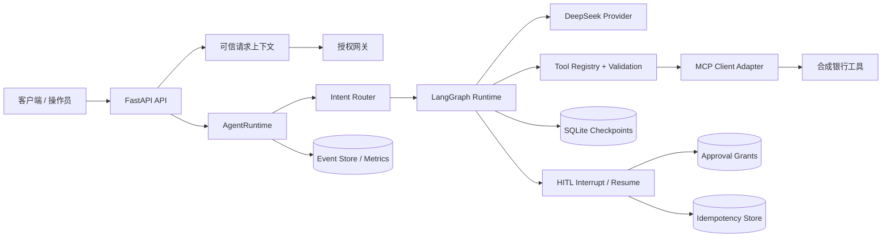

# FxFill 企业级银行智能体

[English](README.md) | [简体中文](README.zh-CN.md)

一个基于 LangGraph、FastAPI、DeepSeek、MCP 风格工具边界、确定性授权、Human-in-the-Loop（HITL）审批和持久化状态构建的企业级导向银行 AI Agent 参考实现。

> **范围与安全声明：** 本仓库是作品集与参考实现，不处理真实资金、真实客户或真实个人信息。未经独立的安全、合规、运维和集成审查，不得用于真实银行生产环境。

## 当前成熟度

| 目标 | 当前判断 |
|---|---|
| 求职作品集 / 技术演示 | 已完成 v0.2.0 作品集版本 |
| 企业内部 production-like 原型 | 部分完成 |
| 真实银行生产系统 | 尚未达到 |

项目展示了企业架构模式，但严格区分 **已实现、已接线、已测试、已进行真实调用验证、可生产使用** 这几个不同层级。

## 最新验证证据

最终作品集验证于 **2026-06-25** 在提交 `ad340f0` 上完成：

| 检查项 | 结果 |
|---|---|
| 软件包版本 | `0.2.0` |
| 自动化测试 | `393 passed, 1 skipped` |
| 行覆盖率 | `src/` 总体 `67.29%` |
| Ruff lint | 通过 |
| Ruff format check | 通过 |
| MyPy | 配置范围内通过，共检查 `89` 个源文件 |
| Docker 镜像构建 | 通过 |
| Docker Compose | `agent`、`postgres`、`redis` 均达到 `healthy` |
| 健康检查 | `GET /health` 和 `GET /health/deep` 均返回 `200` |
| 可信身份 | `user-alice` 可以访问自己的 `ACC-1001` |
| 跨账户隔离 | `user-alice` 无法访问 `ACC-2001` |
| Prompt 身份伪造 | Prompt 提供的身份无法覆盖可信身份 |
| Secret 安全 | `.env` 被忽略，本地 Git 历史常见密钥模式扫描未发现匹配 |

唯一跳过的测试是需要真实 Provider 的 opt-in 测试。OIDC/JWT 验证器已经实现并完成本地测试；真实身份提供商接入、密钥轮换和生产部署验证仍未完成。

本地验证不能替代渗透测试、合规审查、生产认证或受控生产部署。
## 已验证能力

- **有界 LangGraph 运行时**：通过最大步数限制推理和工具循环。
- **FastAPI API**：提供类型化请求与响应。
- **DeepSeek Provider 集成**：使用 OpenAI 兼容请求与响应路径。
- **MCP 风格银行工具边界**：模型不能直接访问银行 Repository。
- **类型化 Tool Registry 与参数校验**：管理工具名、参数、副作用、风险和权限。
- **确定性授权**：Prompt 文本不被视为权限。
- **可信身份注入**：身份敏感的 direct route 工具由服务端注入用户身份。
- **跨账户访问保护**：合成账户数据具有所有权校验。
- **SQLite 持久化**：用于 checkpoint、HITL、grant、idempotency 和 event。
- **HITL interrupt/resume 路径**：敏感操作可暂停并恢复。
- **幂等控制**：用于防止重复副作用。
- **结构化日志、指标和关联 ID 组件**。
- **Docker 与 Docker Compose**：包含健康检查。
- **Kubernetes 与 CI 脚手架**：用于后续生产化。
- **固定且只读的上游 benchmark 依赖**。

## 系统架构



### 信任边界

1. **LLM 输出不可信**：工具名和参数必须经过确定性校验。
2. **Prompt 不是授权机制**：身份、账户所有权、角色、tenant 和审批权限必须来自可信上下文。
3. **模型不能直接修改银行状态**：所有操作必须通过工具边界。
4. **敏感操作必须经过明确策略检查与审批语义。**
5. **上游 benchmark 固定且只读**：不得读取 gold state、答案、奖励或评估器内部逻辑。

## 合成银行工具

| 工具 | 类型 | 功能 |
|---|---|---|
| `get_account_summary` | 只读 | 查询合成账户概要 |
| `get_balance` | 只读 | 查询合成账户余额 |
| `list_transactions` | 只读 | 查询近期合成交易 |
| `find_beneficiary` | 只读 | 查询合成收款人 |
| `get_transfer_status` | 只读 | 查询转账草稿状态 |
| `create_transfer_draft` | 副作用 | 创建转账草稿 |
| `submit_transfer` | 副作用 | 提交转账草稿 |
| `cancel_transfer` | 副作用 | 取消待处理草稿 |
| `report_suspicious_transaction` | 副作用 | 创建合成可疑交易报告 |

仓库内所有账户、收款人、交易和转账数据均为合成数据。

## 快速开始

### 环境要求

- Python `>=3.12,<3.14`
- `uv`
- Git
- 容器路径需要 Docker Desktop 或 Docker Engine
- 真实 Provider 路径需要 DeepSeek API Token

### 安装

```bash
git clone https://github.com/Tito-999/fxfill-enterprise-banking-agent.git
cd fxfill-enterprise-banking-agent
uv sync --group dev
```

复制环境变量示例，并只在本地填写自己的 Token：

```bash
cp .env.example .env
```

不得提交 `.env` 或真实 API Token。

### 本地启动

```bash
export DEEPSEEK_API_TOKEN="your-token"
export FXFILL_DATA_DIR="./data"
export PERSISTENCE_DB_PATH="./data/agent.db"

uv run python -m fxfill_banking_agent.server
```

PowerShell：

```powershell
$env:DEEPSEEK_API_TOKEN = "your-token"
$env:FXFILL_DATA_DIR = "./data"
$env:PERSISTENCE_DB_PATH = "./data/agent.db"

uv run python -m fxfill_banking_agent.server
```

### Docker Compose 启动

```bash
docker compose up -d --build
docker compose ps
curl http://127.0.0.1:8000/health
```

Windows 本地代理环境可使用：

```powershell
curl.exe --noproxy "*" http://127.0.0.1:8000/health
```

### 请求 Agent

开发模式通过 Header 提供身份。以下合成账户属于 `user-alice`：

```bash
curl --noproxy "*" \
  -X POST \
  -H "Content-Type: application/json" \
  -H "X-User-Id: user-alice" \
  -H "X-Tenant-Id: default" \
  -d '{
    "message": "What is the balance of account ACC-1001?",
    "session_id": "demo-session"
  }' \
  http://127.0.0.1:8000/agent
```

预期合成结果：账户 `ACC-1001`，余额 `15000.0 USD`。

## 质量门禁

```bash
uv sync --group dev
uv run pytest
uv run pytest -q --cov=src --cov-report=term-missing
uv run ruff check .
uv run ruff format --check .
uv run mypy src
```

当前本地结果：

```text
393 passed, 1 skipped
总体行覆盖率 67.29%
Ruff 通过
Format check 通过
配置范围内 MyPy 通过，共检查 89 个源文件
```

## 仓库结构

```text
.
├── src/fxfill_banking_agent/
│   ├── agent.py
│   ├── graph.py
│   ├── api.py
│   ├── server.py
│   ├── bootstrap.py
│   ├── auth.py
│   ├── auth_middleware.py
│   ├── approval_executor.py
│   ├── checkpoint_store.py
│   ├── hitl_store.py
│   ├── grant_repo.py
│   ├── idempotency_store.py
│   ├── persistence.py
│   ├── providers/
│   ├── banking/
│   ├── mcp/
│   ├── tools/
│   ├── routing/
│   ├── orchestration/
│   ├── memory/
│   └── rag/
├── tests/
├── docs/
├── k8s/
├── .github/workflows/
├── Dockerfile
├── compose.yaml
├── SPEC.md
├── ROADMAP.md
├── UPSTREAM.lock
└── pyproject.toml
```

## 当前限制

以下限制必须明确保留：

1. **OIDC/JWT 验证器已经实现并完成本地测试。** 真实身份提供商接入、密钥轮换流程和生产部署验证仍待完成。
2. **开发 Header 身份不是生产认证。**
3. **HITL 身份绑定不完整**：部分审批/会话路径仍存在默认身份值或平行执行语义。
4. **SQLite 仍是已验证的权威运行时存储**：PostgreSQL 和 Redis 容器能启动，但尚未成为主运行时的唯一事实源和分布式协调层。
5. **多副本正确性尚未证明**：进程内限流和本地状态使当前系统不能安全宣称支持生产横向扩展。
6. **健康检查较浅**：尚未真实检查所有关键依赖。
7. **CORS 和客户端错误响应仍需生产加固。**
8. **MyPy 对多个关键模块仍配置了 `ignore_errors = true`。**
9. **总体覆盖率为 68%**：部分企业化与运维模块仍为 0% 或低覆盖率。
10. **尚未完成官方 `tau2-bench` `banking_knowledge` 评测。**
11. **真实 Provider 测试默认跳过，需要显式 opt-in。**
12. **Kubernetes、IAM、Observability、Reliability 和 AgentOps 中包含尚未完全接线或运行的 scaffold。**

详细阶段状态与 blocker 请查看 [`docs/execution/STATUS.md`](docs/execution/STATUS.md)。

## 生产化优先级

1. 实现经过密码学验证的 OIDC/JWT。
2. 将可信 subject 和 tenant 绑定到每一条 HITL 与审批记录。
3. 将 graph resume 和副作用执行统一为唯一主链。
4. 让 PostgreSQL 和 Redis 成为生产环境权威依赖。
5. 增加迁移、连接池、事务隔离、乐观锁和分布式幂等。
6. 加固 CORS、错误响应、超时、请求大小限制和健康检查。
7. 移除关键模块的 MyPy 豁免。
8. 提升关键路径覆盖率，并验证并发、崩溃、重试和未知结果。
9. 接通 OpenTelemetry、指标、审计导出、告警、Dashboard 和 Runbook。
10. 完成官方外部 benchmark 和真实 Provider 回归证据。

## Benchmark 完整性

- 上游仓库：`sierra-research/tau2-bench`
- 固定提交：记录于 `UPSTREAM.lock`
- 领域：`banking_knowledge`
- 集成方式：外部固定、只读
- 官方评测：由人工在自动编码 Agent 之外运行
- 不允许读取 benchmark gold answer、reward、评估器内部逻辑或隐藏状态

## 项目准确定位

准确表述：

> 一个具备确定性授权、可信身份传播、HITL 控制、持久化本地状态、容器化和较完整自动化测试的企业级导向银行 Agent 参考实现。

不准确表述：

> 一个已经获准处理真实银行客户和真实资金的 production-ready 银行系统。

## 文档

- `SPEC.md`：项目范围与信任边界
- `ROADMAP.md`：阶段路线图
- `AGENTS.md`：工程规则
- `docs/execution/STATUS.md`：当前实施状态
- `docs/execution/DECISIONS.md`：架构决策
- `docs/execution/TEST_EVIDENCE.md`：验证证据
- `docs/execution/BASELINE_AUDIT.md`：基线审计
