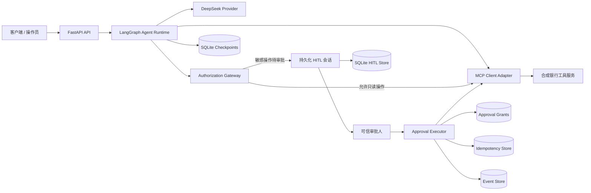

# FxFill 企业级银行智能体

[English](README.md) | [简体中文](README.zh-CN.md)

一个面向企业级架构演示、具备可审计能力的银行 AI Agent。项目基于 LangGraph、FastAPI、MCP 风格工具边界、DeepSeek 与 SQLite，实现了持久化 Human-in-the-Loop（HITL）审批、精确操作授权、幂等执行和故障恢复。


> 本仓库是参考实现与作品集项目，全部银行账户、交易、收款人和转账数据均为合成数据。未经完整的安全、合规和运维审查，不得用于处理真实资金、真实客户或敏感个人信息。

## 项目简介

FxFill Enterprise Banking Agent 展示了如何构建一个“推理由模型驱动，但权限、执行、副作用、持久化和恢复由确定性代码控制”的银行智能体。

系统能够回答账户问题、查询合成交易记录、创建转账草稿，并将敏感操作交给明确的人类审批流程。其核心设计原则包括：

- 默认拒绝的授权策略；
- 绑定到具体操作的单次审批凭证；
- 幂等且可恢复的副作用执行；
- 跨进程重启的持久化状态；
- LLM 推理与银行工具执行严格分离；
- 可查询、可审计的事件记录。

仓库还包含面向公开 `tau2-bench` 的 `banking_knowledge` 领域评测脚手架。上游 benchmark 被固定到指定提交，并始终作为只读依赖使用。

## 核心能力

- **有界 LangGraph 推理循环**：通过硬性步数上限约束推理和工具调用。
- **FastAPI 服务**：提供类型化的 `/health`、`/agent` 和 `/agent/approve` 接口。
- **MCP 风格工具隔离**：模型不能直接访问银行数据仓库，只能通过工具边界调用能力。
- **确定性授权**：敏感操作的安全性不依赖 Prompt 指令。
- **持久化 HITL 审批**：审批会话、授权凭证、状态迁移、过期和恢复信息均写入 SQLite。
- **精确操作授权**：审批绑定 session、用户、thread、tool call、工具名、规范化参数、参数摘要和幂等键。
- **单次授权与幂等执行**：重复请求或重复点击审批不会静默重复执行已确认的副作用。
- **故障与不确定结果恢复**：显式处理 failed、unknown、resumed、expired 和 reconciliation-required 状态。
- **结构化可观测性**：持久化事件、关联信息、模型延迟、Token 用量和结构化日志。
- **Benchmark 完整性约束**：固定上游版本、只读集成、官方评测与日常开发隔离。
- **质量门禁**：单元测试、集成测试、Ruff、MyPy 和阶段验收报告。

## 系统架构



### 信任边界

1. **LLM 输出不可信**：模型生成的工具名和参数必须经过确定性校验与授权。
2. **Prompt 不是授权机制**：所有副作用权限均由代码强制执行。
3. **MCP 边界负责工具执行**：模型不能直接操作银行 Repository。
4. **审批身份必须可信**：HTTP 请求体中的 `approver` 字段只被视为不可信输入。
5. **上游 benchmark 只读**：运行时代码不得读取参考答案、奖励、评估器内部逻辑或 gold state。

## 银行工具

| 工具 | 类型 | 功能 |
|---|---|---|
| `get_account_summary` | 只读 | 查询账户概要 |
| `get_balance` | 只读 | 查询账户余额 |
| `list_transactions` | 只读 | 查询近期交易记录 |
| `find_beneficiary` | 只读 | 按 ID 查询收款人 |
| `get_transfer_status` | 只读 | 查询转账草稿或转账状态 |
| `create_transfer_draft` | 副作用 | 创建但不提交转账草稿 |
| `submit_transfer` | 副作用 | 提交已有转账草稿 |
| `cancel_transfer` | 副作用 | 取消待处理转账草稿 |
| `report_suspicious_transaction` | 副作用 | 创建合成可疑交易报告 |

项目内置的账户、收款人、交易和转账数据均为开发用合成数据。

## 技术栈

| 模块 | 技术 |
|---|---|
| 编程语言 | Python 3.12 或 3.13 |
| Agent 编排 | LangGraph、LangChain Core |
| Web API | FastAPI、Uvicorn、Pydantic |
| LLM Provider | 通过 Anthropic 兼容接口调用 DeepSeek |
| 工具集成 | MCP Client Adapter、进程内合成银行工具服务 |
| 持久化 | SQLite、`aiosqlite` |
| 日志 | `structlog` |
| 测试 | Pytest、Pytest Asyncio |
| 代码质量 | Ruff、MyPy |
| 构建与依赖管理 | Hatchling、`uv` |

## 仓库结构

```text
.
├── src/fxfill_banking_agent/
│   ├── agent.py                 # Agent 运行时
│   ├── graph.py                 # LangGraph 状态图
│   ├── api.py                   # FastAPI 应用工厂
│   ├── bootstrap.py             # 完整依赖组装入口
│   ├── auth.py                  # 授权策略与网关
│   ├── approval_executor.py     # 持久化审批执行器
│   ├── actor_resolver.py        # 可信审批人身份抽象
│   ├── banking/                 # 合成银行数据仓库与工具
│   ├── mcp/                     # MCP 模型与客户端适配器
│   ├── providers/               # LLM Provider 实现
│   ├── db.py                    # Schema 初始化与迁移
│   ├── checkpoint_store.py      # Agent Checkpoint
│   ├── hitl_store.py            # 人工审批会话
│   ├── grant_repo.py            # 精确操作审批凭证
│   ├── idempotency_store.py     # 防止重复执行
│   └── persistence.py           # 持久化事件存储
├── tests/                       # 单元测试与集成测试
├── scripts/run_benchmark.py     # 手动 benchmark 脚手架
├── docs/                        # 架构决策记录
├── reports/phases/              # 阶段验收证据
├── SPEC.md                      # 范围与信任边界
├── ROADMAP.md                   # 阶段规划与验收标准
├── UPSTREAM.lock                # 固定的 tau2-bench 上游版本
└── pyproject.toml
```

## 环境要求

- Python `>=3.12,<3.14`
- 推荐使用 [`uv`](https://docs.astral.sh/uv/) 管理依赖
- 运行真实 Provider 路径需要 DeepSeek API Token
- 克隆仓库和校验上游 benchmark 时需要 Git

## 安装

```bash
git clone https://github.com/Tito-999/fxfill-enterprise-banking-agent.git
cd fxfill-enterprise-banking-agent
uv sync --group dev
```

配置 Provider Token。

### Bash / Zsh

```bash
export DEEPSEEK_API_TOKEN="your-token"
```

### PowerShell

```powershell
$env:DEEPSEEK_API_TOKEN = "your-token"
```

Token 必须保存在环境变量或本地 Secret Manager 中，不得提交到仓库。

## 测试与代码检查

```bash
uv run pytest
uv run ruff check .
uv run ruff format --check .
uv run mypy src
```

## 启动 API

仓库提供异步 `bootstrap_app()` 依赖组装入口。下面的最小启动器会让应用创建与 Uvicorn 运行在同一个事件循环中：

```python
# serve.py
import asyncio

import uvicorn

from fxfill_banking_agent.bootstrap import bootstrap_app


async def main() -> None:
    app = await bootstrap_app(
        db_path="./data/agent.db",
        production_mode=False,
    )
    server = uvicorn.Server(
        uvicorn.Config(app, host="127.0.0.1", port=8000, log_level="info")
    )
    await server.serve()


if __name__ == "__main__":
    asyncio.run(main())
```

```bash
uv run python serve.py
```

启动后可访问：

- OpenAPI 文档：`http://127.0.0.1:8000/docs`
- 健康检查：`http://127.0.0.1:8000/health`

### 健康检查

```bash
curl http://127.0.0.1:8000/health
```

```json
{
  "status": "ok",
  "version": "0.1.0"
}
```

### 请求 Agent

```bash
curl -X POST http://127.0.0.1:8000/agent \
  -H "Content-Type: application/json" \
  -d '{
    "message": "Show the recent transactions for my account.",
    "session_id": "demo-session"
  }'
```

只读请求可以直接完成。涉及副作用的工具调用会被暂停并持久化，等待人工审批。真实部署必须注入经过身份认证的 `ApprovalActorResolver`；开发模式 Resolver 不能替代生产身份认证系统。

## 配置说明

主要配置模型位于：

- `src/fxfill_banking_agent/config.py`
- `src/fxfill_banking_agent/providers/base.py`

| 配置 | 默认值或来源 | 说明 |
|---|---|---|
| `DEEPSEEK_API_TOKEN` | 环境变量 | `bootstrap_app()` 所需 Provider 凭证 |
| Provider Base URL | `https://api.deepseek.com/anthropic/v1` | DeepSeek Anthropic 兼容接口 |
| Provider Model | `deepseek-v4-pro` | `ProviderConfig` 中的默认模型标识 |
| Agent 最大步数 | `50` | 推理与工具循环硬上限 |
| HITL 过期时间 | `30` 分钟 | 待审批会话默认有效期 |
| 幂等记录保留时间 | `90` 天 | 默认记录保留配置 |
| SQLite 路径 | `db_path` 参数 | HITL、Grant、Event、Idempotency 的共享持久化存储 |

当 `production_mode=True` 时，如果缺少持久化数据库或非开发环境的可信审批人 Resolver，应用会主动拒绝启动。

## API 接口

| 方法 | 接口 | 功能 |
|---|---|---|
| `GET` | `/health` | 服务健康状态与版本 |
| `POST` | `/agent` | 新建或继续 Agent 会话 |
| `POST` | `/agent/approve` | 审批或拒绝已持久化的敏感操作 |
| `GET` | `/docs` | FastAPI 自动生成的 Swagger UI |

## HITL 执行模型

敏感操作使用持久化状态机，而不是内存中的确认标志：

1. Agent 提出工具调用。
2. 确定性授权模块判断操作类型。
3. 系统写入待审批 HITL 会话和匹配的 Approval Grant。
4. 可信操作员审批或拒绝该精确操作。
5. Approval Executor 原子化地领取 Grant。
6. 工具分发前预留幂等状态。
7. 同一业务幂等键对应的 MCP 工具最多执行一次。
8. 成功、失败、未知结果或需要人工对账的状态被持久化记录。

因此，对某一次操作的人工批准不会演变成后续所有模型操作的通用授权。

## Benchmark 集成

本项目面向公开 `tau2-bench` 的 `banking_knowledge` 领域。

- `UPSTREAM.lock` 固定外部仓库及其 commit。
- 上游代码默认位于 `../tau2-bench-upstream`。
- 上游仓库始终按只读依赖处理。
- 运行时代码不得读取参考操作、评估器内部逻辑、奖励或 gold state。
- 官方 benchmark 评测必须手动执行，并与日常开发隔离。
- `scripts/run_benchmark.py` 当前提供配置、预检查和结果记录脚手架，不应被描述为已经完成的端到端评测器。

```bash
uv run python scripts/run_benchmark.py \
  --model deepseek-v4-pro \
  --profile default \
  --tasks banking_knowledge
```

内置评测配置包括：

- `default`
- `long-reasoning`
- `fast`

## 开发原则

- 当授权、身份、持久化状态或工具结果不确定时，默认拒绝并停止继续执行。
- LLM 只负责自然语言推理，不负责最终安全决策。
- 所有副作用必须幂等，并能够跨进程重启恢复。
- 每个敏感状态迁移都应留下可查询的审计记录。
- 不得为了开发便利而静默降低生产安全约束。
- Benchmark 开发不得接触评测答案、奖励逻辑和私有评估结果。

## 项目状态

当前仓库已经包含：

- 合成银行工具；
- 真实 Provider 适配器；
- LangGraph Agent 运行时；
- FastAPI 服务；
- 持久化 HITL；
- 精确操作授权凭证；
- 幂等执行和故障恢复；
- SQLite 持久化；
- 单元测试与集成测试；
- Benchmark 集成脚手架。

该项目适合用于企业 Agent 架构展示、安全机制实验和个人作品集评估，但不是经过监管认证的银行产品、真实交易处理系统或可直接上线的生产服务。

## 贡献要求

所有修改都应保持以下不变量：

1. 副作用操作不得绕过确定性授权。
2. 审批必须绑定到具体操作和可信身份上下文。
3. 持久化状态迁移必须能够抵抗重启并保持幂等。
4. 测试不得依赖 benchmark 答案或私有 evaluator 行为。
5. 新增 Provider 和 MCP 集成必须隐藏凭证，并在错误时显式失败。

提交代码前运行：

```bash
uv run pytest
uv run ruff check .
uv run ruff format --check .
uv run mypy src
```
