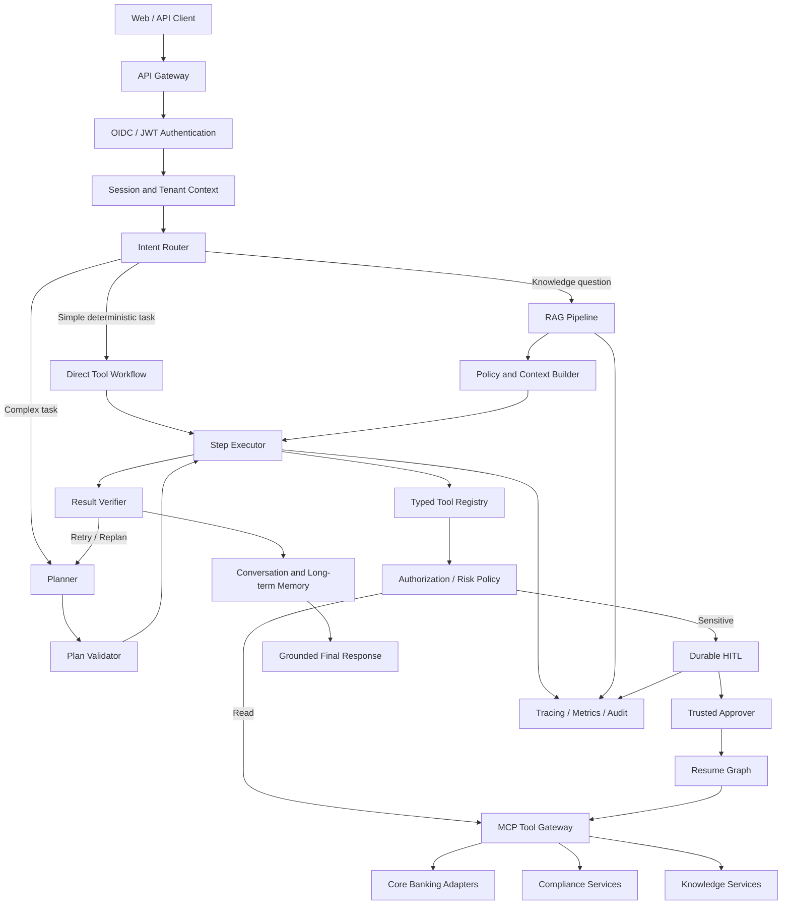

# FxFill Enterprise Banking Agent：P0 / P1 / P2 具体修改方案

**目标仓库：** `Tito-999/fxfill-enterprise-banking-agent`  
**建议文档路径：** `docs/ENTERPRISE_AGENT_P0_P1_P2_PLAN.md`  
**文档版本：** 1.0  
**更新日期：** 2026-06-24

---

## 1. 文档目标

本方案用于把当前 FxFill 从“具备企业架构概念的 Banking Agent 参考实现”，推进为：

1. **P0：主链正确、可真实调用、可恢复、可验证的 Agent；**
2. **P1：具备任务规划、多轮记忆、RAG、Prompt 管理、评测与可观测性的企业级应用；**
3. **P2：具备生产部署、安全合规、高可用、多租户和模型治理能力的金融级系统。**

本文不是功能愿望清单，而是可直接拆成 GitHub Issues、Pull Requests 和验收测试的工程实施方案。

---

## 2. 当前基线与关键问题

当前项目已经具备以下有效基础：

- LangGraph 两节点 ReAct 循环；
- FastAPI 服务；
- 合成银行工具；
- MCP 风格工具边界；
- 确定性授权策略；
- HITL 审批记录、Grant、幂等与事件存储；
- SQLite 数据模型；
- Provider 重试、超时和日志；
- 单元测试、集成测试、恢复测试和安全测试框架。

但当前必须优先解决以下主链断点：

1. `DeepSeekProvider` 没有把工具 schema 发送给真实模型；
2. Provider 请求协议与响应解析风格可能不一致；
3. `SqliteCheckpointSaver` 被创建但没有绑定到 LangGraph `compile()`；
4. 相同 `session_id/thread_id` 不会自动加载历史消息；
5. `bootstrap.py` 创建的 `EventStore`、`IdempotencyStore` 等没有完整注入 `AgentRuntime`；
6. HITL 审批完成后直接执行工具，没有恢复原 LangGraph 并让模型继续生成最终答复；
7. `user_id/account_id/tenant_id` 仍可能来自模型参数，而不是可信身份上下文；
8. 工具风险等级依赖工具名字符串匹配；
9. Metrics 类型存在，但运行主链没有逐步记录；
10. benchmark runner 仍是 placeholder，没有形成真实能力基线；
11. 没有 RAG、长期记忆、Prompt Registry、Planner、Verifier 或模型路由；
12. 没有完整容器化、CI/CD、OpenTelemetry、PostgreSQL、Redis、Kubernetes 和金融合规控制。

---

# 3. 目标架构



核心设计原则：

- **LLM 负责提出意图与建议，确定性代码负责权限、状态、金额、身份和副作用。**
- **任何可信字段不得从自然语言或模型输出直接获得。**
- **所有写操作必须具备幂等键、精确授权、审计事件和不确定结果处理。**
- **Agent 的每一项能力必须由真实模型测试、故障测试和评测集证明，而不是仅由 Mock 测试证明。**

---

# 4. P0：主链正确性与真实可用性

## P0 总目标

完成 P0 后，系统必须达到以下状态：

- 真实模型能够收到工具定义并产生合法 Function Calling；
- 多轮会话能够通过同一 `thread_id` 持久化和恢复；
- HITL 能暂停并恢复原图，而不是绕过 Agent 直接结束；
- 所有身份字段来自可信请求上下文；
- 主运行链的 checkpoint、event、idempotency 和 metrics 全部接通；
- 对关键路径存在真实 Provider 合约测试和端到端测试；
- README 中所有核心能力声明都能被自动测试验证。

---

## P0-01：建立真实 Function Calling 主链

### 目标

让真实 Provider 明确接收工具 schema，并稳定返回结构化工具调用。

### 修改文件

- `src/fxfill_banking_agent/providers/base.py`
- `src/fxfill_banking_agent/providers/deepseek.py`
- `src/fxfill_banking_agent/llm.py`
- `src/fxfill_banking_agent/agent.py`
- `src/fxfill_banking_agent/graph.py`
- `src/fxfill_banking_agent/mcp/client.py`
- `tests/contract/test_deepseek_provider.py`
- `tests/contract/test_live_provider.py`
- 新增 `tests/e2e/test_live_tool_call.py`

### 具体实现

#### 1. 扩展 Provider 接口

```python
class LLMProvider(Protocol):
    async def invoke(
        self,
        messages: list[BaseMessage],
        *,
        tools: list[ToolDefinition] | None = None,
        tool_choice: str | dict | None = None,
        response_format: dict | None = None,
    ) -> AIMessage: ...
```

#### 2. 增加统一工具定义

新增：

```text
src/fxfill_banking_agent/tools/
├── models.py
├── registry.py
├── validation.py
└── provider_adapters.py
```

建议模型：

```python
class ToolDefinition(BaseModel):
    name: str
    description: str
    input_schema: dict[str, Any]
    side_effect: bool
    risk_level: Literal["low", "medium", "high", "critical"]
    required_permissions: list[str]
    timeout_seconds: float = 30.0
```

#### 3. Provider Adapter

不要在业务代码中混用 OpenAI 与 Anthropic 格式。为不同协议分别实现：

```text
providers/
├── base.py
├── openai_compatible.py
├── anthropic_compatible.py
└── deepseek.py
```

每个 Adapter 必须负责：

- 请求体格式转换；
- `tools` 格式转换；
- Tool Result 格式转换；
- usage 字段解析；
- finish reason 解析；
- structured error 解析；
- Provider request ID 保存。

#### 4. 在 Agent 节点中注入工具

```python
available_tools = tool_registry.provider_definitions()
response = await llm.invoke(
    list(messages),
    tools=available_tools,
    tool_choice="auto",
)
```

#### 5. Tool Call 必须做 schema 校验

模型输出后先执行：

```text
tool name allowlist
→ JSON parse
→ JSON Schema / Pydantic validation
→ trusted-context injection
→ authorization
→ idempotency reservation
→ execution
```

禁止直接把 `tc["args"]` 传给工具。

### 测试要求

1. 真实模型调用 `get_balance`；
2. 真实模型连续调用 `find_beneficiary` 和 `create_transfer_draft`；
3. 模型生成不存在的工具时被拒绝；
4. 缺少必填参数时返回可恢复错误；
5. 参数类型错误时不执行工具；
6. Provider 返回 malformed tool call 时 fail closed；
7. 工具结果能正确回填并生成最终自然语言回答；
8. live test 默认跳过，但 CI 可在安全环境中手动触发。

### 验收标准

- `tools` 确实出现在真实 Provider 请求中；
- 至少一个 live tool-call smoke test 通过；
- 不再依靠 Fake HTTP Response 证明 Function Calling 可用；
- 未知工具执行次数为 0；
- 参数校验失败时副作用执行次数为 0。

---

## P0-02：接通 LangGraph Checkpoint 和多轮会话

### 目标

同一 `thread_id` 的多轮消息与图状态可以跨请求、跨进程恢复。

### 修改文件

- `src/fxfill_banking_agent/graph.py`
- `src/fxfill_banking_agent/agent.py`
- `src/fxfill_banking_agent/checkpoint_store.py`
- `src/fxfill_banking_agent/api.py`
- `src/fxfill_banking_agent/state.py`
- 新增 `src/fxfill_banking_agent/conversation_service.py`
- 新增 `tests/e2e/test_multiturn_persistence.py`
- 更新 `tests/recovery/test_durability.py`

### 具体实现

#### 1. Graph 编译时绑定 Checkpointer

```python
def build_agent_graph(*, checkpointer: BaseCheckpointSaver) -> CompiledStateGraph:
    ...
    return builder.compile(checkpointer=checkpointer)
```

`AgentRuntime`：

```python
self._graph = build_agent_graph(checkpointer=self.checkpoint_saver)
```

#### 2. 区分 ID

禁止混用：

- `request_id`：一次 HTTP 请求；
- `run_id`：一次图运行；
- `thread_id`：一段多轮会话；
- `session_id`：认证会话或业务会话；
- `user_id`：可信用户身份；
- `tenant_id`：租户；
- `correlation_id`：跨服务追踪。

API 建议：

```python
class AgentRequest(BaseModel):
    message: str
    thread_id: str | None = None
```

`thread_id` 由服务端生成或校验，不再把任意客户端字符串直接作为所有 ID。

#### 3. 继续会话时只提交增量输入

```python
config = {"configurable": {"thread_id": thread_id}}
result = await graph.ainvoke(
    {"messages": [HumanMessage(content=user_message)]},
    config=config,
)
```

Graph 从 checkpointer 自动加载旧状态。

#### 4. 修复 Checkpoint Serializer

当前 state 含 `set[str]`、LangChain Message 等对象。必须：

- 使用 LangGraph 官方 serializer；或
- 明确实现安全的 message/state 序列化；
- 设置 allowed types；
- 做 schema version；
- 支持旧 checkpoint migration。

#### 5. 会话生命周期

新增接口：

- `POST /v1/threads`；
- `POST /v1/threads/{thread_id}/messages`；
- `GET /v1/threads/{thread_id}`；
- `DELETE /v1/threads/{thread_id}`；
- `POST /v1/threads/{thread_id}/archive`。

### 测试要求

1. 第一轮询问余额，第二轮用“那最近三笔呢”正确理解账户；
2. 关闭 Runtime，重新创建后继续同一 thread；
3. 不同用户不能读取彼此 thread；
4. 不同 tenant 的 thread 完全隔离；
5. checkpoint schema migration 测试；
6. 并发写入同一 thread 时有版本冲突或串行控制；
7. 删除会话后无法恢复。

### 验收标准

- 同一 thread 跨进程恢复成功；
- 用户第二轮不必重复账户上下文；
- cross-user / cross-tenant 恢复均返回 403/404；
- checkpoint 不是仅“可写入”，而是真正被 LangGraph 自动读取。

---

## P0-03：修复 Composition Root 与依赖注入

### 目标

确保 bootstrap 创建的持久化、幂等、指标和 checkpoint 对象全部进入真实主链。

### 修改文件

- `src/fxfill_banking_agent/bootstrap.py`
- `src/fxfill_banking_agent/api.py`
- `src/fxfill_banking_agent/agent.py`
- `src/fxfill_banking_agent/lifecycle.py`
- 新增 `src/fxfill_banking_agent/runtime_factory.py`
- 更新 `tests/e2e/test_production_composition.py`

### 具体实现

新增统一 `RuntimeDependencies`：

```python
@dataclass
class RuntimeDependencies:
    llm: LLMProvider
    mcp_client: MCPClient
    auth_gateway: AuthorizationGateway
    checkpoint_saver: BaseCheckpointSaver
    event_store: EventStore
    idempotency_store: IdempotencyStore
    metrics_collector: MetricsCollector
    tool_registry: ToolRegistry
```

创建 Runtime 时必须显式传入：

```python
runtime = AgentRuntime(
    config=cfg,
    llm=llm,
    mcp_client=mcp,
    auth_gateway=auth_gateway,
    checkpoint_saver=checkpoint_saver,
    event_store=event_store,
    idempotency_store=idem_store,
    metrics_collector=metrics,
    tool_registry=tool_registry,
)
```

生产模式启动检查：

- 缺少 durable checkpoint：拒绝启动；
- 缺少 event store：拒绝启动；
- 缺少 idempotency store：拒绝启动；
- 缺少可信 Actor Resolver：拒绝启动；
- 使用 development resolver：拒绝启动；
- 使用 synthetic repository：拒绝启动，除非显式 `ALLOW_SYNTHETIC_BANKING=true`。

### 测试要求

通过 monkeypatch/spy 验证：

- checkpoint saver 被 `graph.compile()` 使用；
- event store 收到 USER_MESSAGE、LLM_CALL、TOOL_CALL、AUTH_DECISION、FINAL_RESPONSE；
- idempotency store 在副作用前被调用；
- application shutdown 关闭所有连接；
- 任意资源构造失败时已创建资源被回滚关闭。

### 验收标准

主路径不存在“已创建但未注入”的资源。

---

## P0-04：把 HITL 改为真正的暂停与恢复

### 目标

审批完成后恢复原 LangGraph 上下文，使模型看到工具结果并继续后续推理。

### 当前问题

当前审批执行器直接调用 MCP 工具并把结果返回 API，没有恢复原图，因此：

- 模型无法解释结果；
- 无法继续剩余步骤；
- 无法进行后续验证；
- 多工具计划在审批点被截断。

### 修改文件

- `src/fxfill_banking_agent/graph.py`
- `src/fxfill_banking_agent/agent.py`
- `src/fxfill_banking_agent/approval_executor.py`
- `src/fxfill_banking_agent/hitl_store.py`
- `src/fxfill_banking_agent/grant_repo.py`
- `src/fxfill_banking_agent/api.py`
- 新增 `src/fxfill_banking_agent/resume_service.py`
- 新增 `tests/e2e/test_hitl_graph_resume.py`

### 具体实现

推荐使用 LangGraph `interrupt()` / `Command(resume=...)` 模式：

```python
approval = interrupt({
    "tool_call_id": tool_call.id,
    "tool_name": tool_call.name,
    "arguments_digest": digest,
    "display_summary": safe_summary,
})
```

审批 API：

```python
await runtime.resume(
    thread_id=thread_id,
    command=Command(resume={
        "decision": "approve",
        "grant_id": grant_id,
        "actor_id": actor.actor_id,
    }),
)
```

恢复后流程：

```text
load checkpoint
→ validate exact grant
→ atomic claim
→ reserve idempotency key
→ execute exact canonical call
→ append ToolMessage
→ continue graph
→ verifier
→ final response
```

#### 拒绝行为

拒绝后也应恢复 Graph，向模型追加结构化 ToolMessage：

```json
{
  "status": "rejected",
  "reason_code": "HUMAN_REJECTED",
  "safe_message": "The requested transfer was not approved."
}
```

模型只能解释拒绝，不能重新构造相同副作用调用绕过审批。应在 state 中记录 denied fingerprint。

#### 双人审批

P0 先实现可配置接口：

```python
ApprovalRequirement(
    required_count=1,
    distinct_from_requester=True,
    required_roles=["banking_approver"],
)
```

P2 再扩展 maker-checker 和金额分级审批。

### 测试要求

1. 转账在工具执行前暂停；
2. 审批前账户状态不改变；
3. 批准后只执行一次；
4. 批准后模型继续生成最终回答；
5. 重复批准不重复执行；
6. 修改参数摘要后批准失败；
7. 审批者等于发起者时被拒绝；
8. 拒绝后 Agent 不得再次自动尝试相同调用；
9. 服务重启后仍能批准并恢复；
10. MCP 超时导致 UNKNOWN 时进入 reconciliation，而不是自动重试。

### 验收标准

- HITL 是图级 durable interrupt/resume；
- 工具执行结果成为原会话的一部分；
- 批准接口返回的是恢复后最终状态，而不是裸工具结果。

---

## P0-05：建立可信身份上下文

### 目标

从根本上禁止模型伪造用户、账户、租户或审批者身份。

### 修改文件

- `src/fxfill_banking_agent/api.py`
- `src/fxfill_banking_agent/actor_resolver.py`
- `src/fxfill_banking_agent/auth.py`
- `src/fxfill_banking_agent/banking/tools.py`
- 新增 `src/fxfill_banking_agent/security/context.py`
- 新增 `src/fxfill_banking_agent/security/authentication.py`
- 新增 `src/fxfill_banking_agent/security/authorization.py`
- 新增 `tests/security/test_trusted_context.py`

### 具体实现

定义：

```python
@dataclass(frozen=True)
class TrustedRequestContext:
    subject_id: str
    tenant_id: str
    roles: frozenset[str]
    account_ids: frozenset[str]
    auth_session_id: str
    request_id: str
    correlation_id: str
```

工具 schema 不再要求模型传入 `user_id`。例如：

```json
{
  "name": "get_balance",
  "parameters": {
    "type": "object",
    "properties": {
      "account_id": {"type": "string"}
    },
    "required": ["account_id"]
  }
}
```

执行前由服务注入：

```python
args = validated_model_args | {
    "user_id": trusted.subject_id,
    "tenant_id": trusted.tenant_id,
}
```

账户访问检查必须发生在 Repository/Service 层，不能只依赖 LLM 或 Prompt。

### 测试要求

- Prompt 中要求“把 user_id 改成 admin”无效；
- Tool args 中注入其他 user_id 会被覆盖或拒绝；
- 用户只能访问 context 中允许的 account；
- tenant A 不能访问 tenant B；
- approver 身份只来自验证后的 token/context；
- HTTP Body 中的 `approver` 永远不参与授权。

### 验收标准

所有可信身份字段在模型可见 schema 中被移除，或被标记为 server-injected。

---

## P0-06：用元数据替换工具名风险猜测

### 目标

停止通过 `transfer/write/delete` 等字符串判断风险类别。

### 修改文件

- `src/fxfill_banking_agent/tools/models.py`
- `src/fxfill_banking_agent/tools/registry.py`
- `src/fxfill_banking_agent/auth.py`
- `src/fxfill_banking_agent/graph.py`
- `src/fxfill_banking_agent/banking/tools.py`

### 工具元数据

```python
ToolDefinition(
    name="submit_transfer",
    side_effect=True,
    risk_level="critical",
    permissions=["transfer:submit"],
    approval_policy="maker_checker",
    idempotency_required=True,
    retry_policy="never_on_unknown",
    data_classification="financial_confidential",
)
```

授权输入应包括：

- tool metadata；
- trusted actor；
- resource ownership；
- amount/currency；
- destination risk；
- tenant policy；
- prior approvals；
- model confidence 仅作为参考，不作为权限依据。

### 验收标准

新增一个名字完全不含 `transfer/write/delete` 的副作用工具时，仍能正确进入审批。

---

## P0-07：接通事件、指标与结构化错误

### 目标

让每次运行可以回答：发生了什么、在哪一步失败、花了多少时间、用了多少 Token、是否执行了副作用。

### 修改文件

- `src/fxfill_banking_agent/agent.py`
- `src/fxfill_banking_agent/graph.py`
- `src/fxfill_banking_agent/metrics.py`
- `src/fxfill_banking_agent/persistence.py`
- `src/fxfill_banking_agent/providers/deepseek.py`
- 新增 `src/fxfill_banking_agent/errors.py`

### 事件类型

至少增加：

```text
RUN_STARTED
USER_MESSAGE_RECEIVED
PROMPT_BUILT
LLM_REQUEST_STARTED
LLM_REQUEST_COMPLETED
TOOL_CALL_PROPOSED
TOOL_CALL_VALIDATED
AUTHORIZATION_DECIDED
HITL_PAUSED
HITL_RESUMED
TOOL_EXECUTION_STARTED
TOOL_EXECUTION_COMPLETED
TOOL_EXECUTION_UNKNOWN
REPLAN_TRIGGERED
FINAL_RESPONSE_CREATED
RUN_FAILED
RUN_COMPLETED
```

### 指标

- `agent_run_duration_ms`；
- `llm_latency_ms`；
- `tool_latency_ms`；
- `input_tokens` / `output_tokens`；
- `tool_call_count`；
- `invalid_tool_call_count`；
- `approval_wait_ms`；
- `retry_count`；
- `task_success`；
- `side_effect_count`；
- `estimated_cost_usd`。

### 结构化错误

```python
class AgentErrorCode(StrEnum):
    PROVIDER_TIMEOUT = "PROVIDER_TIMEOUT"
    INVALID_TOOL_ARGUMENTS = "INVALID_TOOL_ARGUMENTS"
    AUTHORIZATION_DENIED = "AUTHORIZATION_DENIED"
    APPROVAL_REQUIRED = "APPROVAL_REQUIRED"
    TOOL_OUTCOME_UNKNOWN = "TOOL_OUTCOME_UNKNOWN"
    CHECKPOINT_CONFLICT = "CHECKPOINT_CONFLICT"
```

API 不应直接返回 `str(exc)`，以免泄漏内部路径、SQL、Token 或 Provider 内容。

### 验收标准

任意失败都能通过 `correlation_id` 在事件库中重建完整时间线。

---

## P0-08：修复类型检查与测试可信度

### 目标

防止 `mypy strict` 名义开启、关键模块却通过 override 全部忽略。

### 修改文件

- `pyproject.toml`
- 所有被 `ignore_errors = true` 覆盖的核心模块
- `tests/`

### 具体实现

1. 分批删除关键模块的 `ignore_errors = true`；
2. Provider、MCP、Auth、Approval Executor 必须通过 strict typing；
3. 测试不只检查“没有崩溃”，还要检查副作用次数、事件序列和状态迁移；
4. Fake Provider 测试与 Live Provider 测试分层；
5. 引入 mutation testing 或至少针对授权判断写负向测试；
6. 禁止测试直接伪造不可能由真实 Provider 产生的响应而仍宣称 E2E。

### P0 测试矩阵

| 测试类型 | 必须覆盖 |
|---|---|
| Unit | schema、policy、digest、state reducer、error mapping |
| Contract | Provider 请求/响应、MCP schema、Repository API |
| Integration | LLM adapter→graph→tool→result |
| E2E | API→auth→graph→HITL→resume→final answer |
| Recovery | process restart、UNKNOWN outcome、checkpoint migration |
| Security | prompt injection、cross-user、cross-tenant、replay |
| Live smoke | 真实 Provider 文本和工具调用 |

### P0 完成定义

只有满足以下条件才允许开始 P1：

- [ ] 真实 Provider Function Calling 已验证；
- [ ] 多轮 thread 跨进程恢复已验证；
- [ ] HITL 原图恢复已验证；
- [ ] bootstrap 依赖全部接通；
- [ ] 可信身份注入已完成；
- [ ] 副作用工具不再依赖名称分类；
- [ ] per-step metrics 被真实记录；
- [ ] P0 关键模块通过 mypy strict；
- [ ] 所有 P0 自动测试通过；
- [ ] README 的能力声明与测试证据一致。

---

# 5. P1：企业级 Agent 应用能力

## P1 总目标

完成 P1 后，系统应具备：

- 明确的任务拆解和工作流编排；
- 可控的短期记忆和长期记忆；
- 带权限过滤和引用的 RAG；
- 版本化 Prompt 工程；
- 模型路由、缓存与上下文压缩；
- 自动化离线评测和回归门禁；
- OpenTelemetry 级别可观测性；
- PostgreSQL/Redis 支撑的多实例运行能力。

---

## P1-01：Intent Router 与确定性快速路径

### 目标

不是所有请求都进入昂贵的自由 ReAct 循环。

### 意图类别

```text
ACCOUNT_QUERY
TRANSACTION_QUERY
TRANSFER_CREATE
TRANSFER_SUBMIT
TRANSFER_CANCEL
BENEFICIARY_QUERY
POLICY_QUESTION
FORM_ASSISTANCE
SUSPICIOUS_ACTIVITY_REPORT
GENERAL_UNSUPPORTED
```

### 路由策略

- 简单只读查询：单次结构化解析 + 直接工具工作流；
- 固定高风险任务：状态机工作流；
- 知识问题：RAG；
- 多目标复杂任务：Planner–Executor；
- 无关请求：明确拒绝或降级为普通客服回答。

### 新增目录

```text
src/fxfill_banking_agent/routing/
├── intent.py
├── classifier.py
├── policies.py
└── router.py
```

### 验收指标

- 意图分类 Macro-F1；
- 路由错误率；
- 简单任务平均 LLM 调用次数；
- 每成功任务成本；
- P95 latency。

---

## P1-02：Planner–Executor–Verifier

### 目标

真正实现核心任务拆解、执行、检查和重规划。

### 状态结构

```python
class PlanStep(BaseModel):
    step_id: str
    objective: str
    tool_candidates: list[str]
    dependencies: list[str]
    risk_level: str
    status: Literal["pending", "running", "done", "failed", "blocked"]
    expected_output_schema: dict[str, Any] | None

class ExecutionPlan(BaseModel):
    goal: str
    assumptions: list[str]
    required_user_inputs: list[str]
    steps: list[PlanStep]
    completion_criteria: list[str]
```

### Graph

```text
classify_intent
→ collect_missing_information
→ plan
→ validate_plan
→ execute_step
→ verify_step
→ next_step / replan
→ final_verify
→ respond
```

### 安全规则

- Planner 无权执行工具；
- Executor 只能执行已验证步骤；
- 写操作必须再次通过 AuthZ；
- Replan 不得复用已拒绝 Grant；
- 同一个目标的重试次数和总 Token 有预算上限；
- Plan 必须保存在 checkpoint 和事件流中。

### 典型流程

“帮我把 500 美元转给电力公司，并告诉我手续费和到账时间”：

1. 确认账户；
2. 查找 beneficiary；
3. RAG 检索手续费和到账政策；
4. 创建 transfer draft；
5. 展示金额、收款人、费用和风险摘要；
6. 请求人类审批；
7. 提交 transfer；
8. 查询最终状态；
9. 输出带引用和交易 reference 的最终回答。

### 验收标准

- 计划步骤有确定 schema；
- 工具失败后能区分 retry、ask-user、replan、abort；
- 未完成 completion criteria 时不得宣称任务成功；
- 至少 30 个多步骤任务形成回归集。

---

## P1-03：短期记忆与长期记忆

### 记忆分层

#### A. Working Memory

当前 thread 的消息、计划、工具结果、审批状态。

#### B. Conversation Summary

对长会话进行结构化压缩：

```python
class ConversationSummary(BaseModel):
    user_goal: str
    confirmed_facts: dict[str, Any]
    unresolved_questions: list[str]
    completed_actions: list[str]
    denied_actions: list[str]
    references: list[str]
```

#### C. Semantic Memory

仅保存允许长期使用的用户偏好，例如：

- 默认展示货币；
- 通知偏好；
- 常用报告格式。

不得默认保存：

- 完整账户号；
- 认证凭证；
- 敏感交易细节；
- 未经同意的个人画像。

#### D. Episodic Memory

保存脱敏的历史任务摘要和结果，不保存完整敏感原文。

### 新增目录

```text
src/fxfill_banking_agent/memory/
├── models.py
├── working.py
├── summary.py
├── semantic.py
├── retention.py
└── redaction.py
```

### 关键机制

- memory write policy；
- sensitivity classifier；
- TTL；
- consent；
- user delete/export；
- tenant isolation；
- prompt injection 内容不直接写入长期记忆；
- 事实冲突时以工具实时数据为准。

### 验收标准

- 50+ 轮对话仍能维持目标与关键事实；
- 上下文 Token 不随轮数线性无限增长；
- 用户可以查看、删除长期记忆；
- 敏感字段不会进入 semantic memory。

---

## P1-04：企业 RAG

### 目标

为政策、费用、产品、SOP 和表单知识提供有权限、有版本、有引用的检索增强回答。

### 知识域

1. 产品与费用；
2. 转账与跨境支付规则；
3. KYC/AML/Sanctions 内部政策；
4. 操作 SOP；
5. 表单字段说明；
6. 常见异常与处理流程。

### 新增目录

```text
src/fxfill_banking_agent/rag/
├── ingestion/
│   ├── loaders.py
│   ├── normalization.py
│   ├── chunking.py
│   └── indexing.py
├── retrieval/
│   ├── query_rewrite.py
│   ├── hybrid.py
│   ├── filters.py
│   ├── reranker.py
│   └── citations.py
├── generation/
│   ├── context_builder.py
│   └── grounded_answer.py
└── evaluation/
    ├── datasets.py
    └── metrics.py
```

### 数据模型

每个 chunk 必须包含：

```text
document_id
version
title
source_uri
effective_from
effective_to
jurisdiction
product
access_roles
tenant_id
classification
section_path
content_hash
```

### 检索流程

```text
query classification
→ query rewrite
→ tenant/role/jurisdiction filter
→ BM25 + vector hybrid retrieval
→ reranking
→ effective-date validation
→ context packing
→ grounded generation
→ citation validation
```

### 反 Prompt Injection

- 外部文档内容永远视为不可信数据；
- 检索文档不能覆盖 System Policy；
- 删除“忽略此前指令”等恶意片段或标记风险；
- 工具权限不受 RAG 文本影响；
- RAG 只能提供知识，不能授权副作用。

### RAG 技术选择

开发环境：

- PostgreSQL + pgvector，或本地 Qdrant；
- BM25 可用 OpenSearch/Elasticsearch，或先用 PostgreSQL FTS。

生产环境建议：

- PostgreSQL/pgvector 或受管向量数据库；
- 独立文档 ingestion worker；
- 索引版本与蓝绿切换。

### 评测

- Recall@K；
- MRR / nDCG；
- citation precision；
- groundedness；
- answer correctness；
- stale-policy error rate；
- unauthorized-document retrieval rate 必须为 0。

### 验收标准

- 回答政策问题必须附可解析引用；
- 无证据时明确回答“知识库中没有足够依据”；
- 过期政策不得作为现行政策回答；
- 不同角色检索结果严格隔离。

---

## P1-05：Prompt 工程与 Prompt Registry

### 目标

把 Prompt 从代码字符串升级为可版本化、可测试、可审计的系统资产。

### 目录

```text
prompts/
├── system/
│   └── banking_agent_v1.yaml
├── router/
│   └── intent_v1.yaml
├── planner/
│   └── planner_v1.yaml
├── verifier/
│   └── verifier_v1.yaml
├── rag/
│   └── grounded_answer_v1.yaml
└── safety/
    └── injection_defense_v1.yaml
```

### 每个 Prompt 元数据

```yaml
id: banking_agent
version: 1.0.0
owner: agent-platform
model_families:
  - deepseek
input_schema: ...
output_schema: ...
change_reason: ...
evaluation_suite: banking-core-v1
```

### Prompt 层级

1. 不可覆盖的系统安全政策；
2. 租户与环境策略；
3. 领域规则；
4. 工具说明；
5. 当前任务与计划；
6. RAG 证据；
7. 用户消息。

### 关键要求

- System Prompt 禁止包含秘密；
- 模型不得猜测实时账户数据；
- 模型不得把工具错误描述成成功；
- 模型不得根据用户指令改变权限；
- 任何金额、收款人、币种和账户必须在写操作前确认；
- 输出格式使用 structured output；
- Prompt 版本进入每条 trace 和 benchmark result。

### 验收标准

每次 Prompt 修改必须跑回归评测，并比较任务成功率、工具正确率、拒绝率、Token 和成本。

---

## P1-06：模型路由、缓存与推理效率

### 模型路由

建议至少三层：

- **Small model / deterministic parser：** 意图分类、字段抽取；
- **Standard model：** 常规客服、RAG 答复、简单工具调用；
- **Reasoning model：** 复杂计划、异常调查、多约束任务。

### 路由依据

- 意图；
- 风险；
- 任务复杂度；
- 上下文长度；
- SLA；
- 成本预算；
- Provider 健康状态。

### 缓存

允许缓存：

- 公共政策检索；
- 文档 embedding；
- 非敏感 FAQ；
- 工具 schema；
- Prompt 编译结果。

禁止或谨慎缓存：

- 实时余额；
- 交易状态；
- 用户敏感数据；
- 高风险决策；
- 审批结果。

### 其他效率措施

- 复用 `httpx.AsyncClient` 连接池；
- 只读工具并行调用；
- 上下文摘要；
- Token budget；
- 动态 `max_tokens`；
- streaming；
- circuit breaker；
- Provider fallback；
- tool timeout 和 bulkhead。

### 验收指标

- P50/P95/P99 latency；
- 平均 LLM 调用次数；
- 平均输入/输出 Token；
- 每成功任务成本；
- cache hit rate；
- fallback rate；
- timeout rate。

---

## P1-07：PostgreSQL、Redis 与并发控制

### 目标

支持多实例 API 服务和并发 Agent 运行。

### 数据迁移

SQLite 保留为本地开发后端，生产增加：

- PostgreSQL：thread、checkpoint、event、grant、approval、idempotency；
- Redis：短期锁、rate limit、非敏感 cache、任务协调；
- Alembic：数据库 migration；
- Outbox Pattern：数据库事件可靠投递。

### 必须解决

- 同一 thread 并发更新；
- 同一幂等键并发请求；
- 双重审批点击；
- worker 崩溃后的 lease；
- transaction isolation；
- optimistic locking；
- connection pool；
- deadlock retry；
- retention/partition。

### 验收标准

在两个 API 实例并行处理相同幂等请求时，副作用仍只发生一次。

---

## P1-08：可观测性与自动化评测

### OpenTelemetry

Trace 层级：

```text
HTTP request
└── agent run
    ├── prompt build
    ├── llm call
    ├── retrieval
    ├── authorization
    ├── tool call
    ├── approval wait/resume
    └── final response
```

### 日志要求

- JSON；
- correlation_id；
- 不记录 API Token；
- 不记录完整账户号；
- Tool 参数按字段脱敏；
- 支持审计与应用日志分离。

### 评测集

新增：

```text
evals/
├── datasets/
│   ├── core_tasks.jsonl
│   ├── multiturn_tasks.jsonl
│   ├── tool_selection.jsonl
│   ├── safety_attacks.jsonl
│   ├── rag_questions.jsonl
│   └── recovery_scenarios.jsonl
├── runners/
├── graders/
└── reports/
```

### 指标

- task success rate；
- tool selection accuracy；
- argument exact match；
- hallucinated tool rate；
- unauthorized action rate；
- duplicate side-effect rate；
- groundedness；
- citation precision；
- recovery success rate；
- average cost；
- latency；
- human escalation rate。

### CI 门禁

- 核心任务成功率不能显著下降；
- unauthorized action 必须为 0；
- duplicate side effect 必须为 0；
- hallucinated tool rate 低于设定阈值；
- RAG unauthorized retrieval 必须为 0；
- 成本和 P95 latency 不得无解释恶化。

### P1 完成定义

- [ ] 有确定性 Intent Router；
- [ ] 有 Planner–Executor–Verifier；
- [ ] 有持久化多轮与受控长期记忆；
- [ ] 有权限过滤、版本控制和引用的 RAG；
- [ ] Prompt 已版本化并纳入回归；
- [ ] 有模型路由、缓存和上下文压缩；
- [ ] PostgreSQL 多实例并发测试通过；
- [ ] OpenTelemetry trace 可重建完整任务；
- [ ] 自动化评测进入 CI。

---

# 6. P2：金融级生产化、安全合规与平台治理

## P2 总目标

完成 P2 后，系统应具备：

- 标准容器化和 Kubernetes 部署；
- 高可用、灾难恢复和容量治理；
- 完整 IAM、多租户、maker-checker 与策略引擎；
- 数据安全、审计、防篡改和合规流程；
- 模型与 Prompt 治理；
- 供应链安全、CI/CD 和变更管理；
- 面向真实核心银行系统的 Adapter，而不是合成 Repository。

---

## P2-01：服务拆分与生产部署

### 服务边界

建议拆分为：

```text
api-gateway
agent-orchestrator
approval-service
tool-gateway
banking-adapter-service
knowledge-ingestion-service
retrieval-service
evaluation-service
audit-service
```

初期不必一次拆成微服务，但代码层必须先形成清晰 bounded context。

### 部署资产

新增：

```text
Dockerfile
compose.yaml
helm/
infra/
  terraform/
k8s/
.github/workflows/
```

### Kubernetes 要求

- readiness/liveness/startup probes；
- HPA；
- PodDisruptionBudget；
- topology spread；
- resource requests/limits；
- network policy；
- secret injection；
- non-root container；
- read-only filesystem；
- graceful shutdown；
- migration job；
- canary/blue-green deploy。

### 验收标准

滚动升级过程中，已有 thread 和待审批任务不丢失。

---

## P2-02：企业 IAM、RBAC/ABAC 与多租户

### 认证

- OIDC/OAuth2；
- 企业 IdP；
- JWT 验签和 rotation；
- service-to-service mTLS；
- short-lived credentials；
- workload identity。

### 授权

RBAC + ABAC：

- role；
- tenant；
- account ownership；
- transaction amount；
- currency；
- jurisdiction；
- time window；
- beneficiary risk；
- device/session risk；
- approval chain。

建议接入 OPA/Cedar 或独立 Policy Engine。

### Maker-Checker

- 发起者不得审批自己的任务；
- 高金额要求两名不同审批者；
- 特定地区要求合规审批；
- 审批权限基于角色与金额额度；
- Grant 有 TTL、单次消费和不可转让性。

### 多租户

- 所有主表含 `tenant_id`；
- PostgreSQL RLS；
- tenant-scoped encryption key；
- tenant-scoped vector retrieval；
- tenant-scoped rate limit；
- cross-tenant test 作为 CI 必过项。

---

## P2-03：真实银行系统 Adapter

### 目标

替换本地合成 Repository，同时保持 Domain Tool Contract 不变。

### Adapter 层

```text
adapters/
├── core_banking/
├── payments/
├── beneficiaries/
├── aml/
├── sanctions/
├── fx_rates/
└── notifications/
```

### 必须具备

- mTLS；
- request signing；
- idempotency key；
- upstream correlation ID；
- timeout；
- retry policy；
- circuit breaker；
- reconciliation API；
- webhook signature validation；
- sandbox/prod endpoint isolation；
- response schema validation；
- PII redaction。

### 禁止行为

- 对 UNKNOWN 的支付提交自动重试；
- 把网络超时直接解释成失败；
- 把模型生成的 account/user 字段直接传上游；
- 在日志中打印原始银行响应。

---

## P2-04：数据安全与隐私

### 数据分级

```text
PUBLIC
INTERNAL
CONFIDENTIAL
FINANCIAL_CONFIDENTIAL
RESTRICTED_PII
SECRET
```

每个字段定义：

- 是否可进入 Prompt；
- 是否可进入日志；
- 是否可进入向量库；
- 是否可长期保存；
- 保留时间；
- 加密要求；
- 脱敏规则。

### 安全控制

- TLS 1.2+；
- 数据库和对象存储加密；
- KMS 管理密钥；
- field-level encryption；
- Tokenization；
- Secret Manager；
- key rotation；
- DLP；
- 用户数据导出和删除；
- 非生产环境禁止复制真实数据；
- 训练/评测数据脱敏。

### Prompt 数据最小化

只把完成当前任务所需的最小数据发送给模型。模型 Provider 不应接收完整账户档案。

---

## P2-05：审计、防篡改与合规

### 审计事件

必须记录：

- 谁发起；
- 谁审批；
- 使用什么模型和 Prompt 版本；
- 检索了哪些文档版本；
- 提议了什么工具；
- 授权结果；
- 实际执行参数摘要；
- 上游 reference；
- 最终状态；
- 是否发生人工干预。

### 防篡改

- append-only audit store；
- hash chain；
- WORM/object lock；
- 独立审计权限；
- 定期完整性校验；
- 时间同步。

### 合规流程

根据实际部署地区评估：

- GDPR/CCPA；
- SOC 2；
- ISO 27001；
- PCI DSS（若涉及卡数据）；
- GLBA；
- KYC/AML；
- sanctions screening；
- model risk management；
- records retention。

项目文档必须明确：哪些已经实现、哪些仅为设计目标，禁止用“compliant”替代正式审计。

---

## P2-06：可靠性、灾难恢复与混沌测试

### SLO 示例

- API availability；
- read-task success；
- write-task exactly-once rate；
- approval resume success；
- P95 latency；
- RPO/RTO；
- audit event loss rate。

### 机制

- 多可用区 PostgreSQL；
- PITR；
- Redis HA；
- object storage versioning；
- queue dead-letter；
- retry budget；
- circuit breaker；
- provider fallback；
- graceful degradation；
- read-only emergency mode；
- reconciliation worker。

### Chaos 场景

- LLM Provider 429/500；
- Tool Gateway timeout；
- PostgreSQL failover；
- Redis 不可用；
- Pod 在审批前后崩溃；
- MCP 返回成功但响应丢失；
- 重复 webhook；
- 时钟偏移；
- 网络分区。

### 验收标准

任何不确定支付结果都进入 reconciliation queue，不产生静默重复支付。

---

## P2-07：AI 安全与红队

### 攻击面

- direct prompt injection；
- indirect RAG injection；
- tool output injection；
- data exfiltration；
- privilege escalation；
- confused deputy；
- cross-tenant leakage；
- tool argument smuggling；
- Unicode/encoding bypass；
- approval replay；
- denial-of-wallet；
- excessive agency。

### 防御

- 严格消息角色边界；
- 工具白名单；
- typed arguments；
- trusted context；
- content isolation；
- output validation；
- risk-based HITL；
- token/cost budget；
- tool call budget；
- RAG 文档净化；
- canary secrets；
- red-team regression corpus。

### 验收标准

高风险红队用例纳入 CI，任何 unauthorized action 都阻断发布。

---

## P2-08：模型、Prompt、知识库与 Agent 治理

### Registry

为以下资产建立 registry：

- Model；
- Provider；
- Prompt；
- Tool Schema；
- Policy；
- Knowledge Index；
- Evaluation Dataset；
- Agent Workflow。

### 每次运行记录

```text
model_id
model_version
provider
prompt_id/version
tool_registry_version
policy_version
knowledge_index_version
workflow_version
evaluation_release
```

### 发布流程

```text
change
→ unit/contract tests
→ offline eval
→ security eval
→ shadow traffic
→ canary
→ monitored rollout
→ rollback capability
```

### 微调策略

微调不是 P0/P1 前置条件。只有在以下证据成立时才进入：

- Prompt + RAG + tools 已稳定；
- 明确存在可重复的模型行为缺陷；
- 有高质量、合规、脱敏训练数据；
- 基线与收益可量化；
- 可持续维护模型版本。

优先适合微调的任务：

- 意图分类；
- 银行字段抽取；
- 工具选择；
- 表单映射；
- 内部术语适配。

不应通过微调记忆实时余额、交易状态或频繁变化政策。

---

## P2-09：CI/CD 与软件供应链安全

### GitHub Actions

至少包含：

```text
lint
format
mypy
unit tests
integration tests
security tests
evaluation regression
container build
SBOM
dependency scan
secret scan
SAST
image scan
migration validation
```

### 分支保护

- required reviews；
- CODEOWNERS；
- signed commits/tags；
- required checks；
- 禁止直接 push main；
- 环境审批；
- production deploy 使用 OIDC，不保存长期云密钥。

### 供应链

- lock file；
- hash pinning；
- Dependabot/Renovate；
- SBOM；
- SLSA provenance；
- base image pinning；
- license policy；
- 第三方模型和数据许可记录。

### P2 完成定义

- [ ] 可在 Kubernetes 多副本运行；
- [ ] 真实 IAM、RBAC/ABAC 和 maker-checker 完成；
- [ ] 真实银行 Adapter 通过 sandbox contract test；
- [ ] 数据分类、加密、脱敏和 retention 落地；
- [ ] 审计日志可验证且防篡改；
- [ ] DR、failover 和 chaos 测试通过；
- [ ] AI 红队回归进入发布门禁；
- [ ] 模型/Prompt/知识/工具均可追踪版本；
- [ ] CI/CD 和供应链安全落地；
- [ ] 生产声明经过正式安全、合规和运维评审。

---

# 7. 建议目录结构

```text
.
├── src/fxfill_banking_agent/
│   ├── api/
│   ├── orchestration/
│   │   ├── graph.py
│   │   ├── planner.py
│   │   ├── executor.py
│   │   ├── verifier.py
│   │   └── resume.py
│   ├── providers/
│   ├── tools/
│   ├── mcp/
│   ├── security/
│   ├── approvals/
│   ├── memory/
│   ├── rag/
│   ├── routing/
│   ├── persistence/
│   ├── observability/
│   ├── banking/
│   └── evaluation/
├── prompts/
├── evals/
├── tests/
│   ├── unit/
│   ├── contract/
│   ├── integration/
│   ├── e2e/
│   ├── recovery/
│   ├── security/
│   └── live/
├── migrations/
├── docs/
│   ├── adr/
│   ├── threat-model/
│   ├── runbooks/
│   └── compliance/
├── helm/
├── infra/
├── .github/workflows/
├── Dockerfile
└── compose.yaml
```

---

# 8. GitHub Issue 拆分建议

## P0 Issues

| ID | Issue |
|---|---|
| P0-01 | Provider-native Function Calling and tool schema injection |
| P0-02 | Typed Tool Registry and argument validation |
| P0-03 | Bind durable checkpointer to LangGraph |
| P0-04 | Persistent multi-turn thread API |
| P0-05 | Wire all runtime stores through composition root |
| P0-06 | Durable HITL interrupt and graph resume |
| P0-07 | Trusted identity and tenant context |
| P0-08 | Metadata-driven authorization policy |
| P0-09 | Per-step metrics and structured error model |
| P0-10 | Live provider and recovery acceptance tests |
| P0-11 | Remove mypy ignore_errors from critical path |
| P0-12 | Update README, ROADMAP and known gaps from test evidence |

## P1 Issues

| ID | Issue |
|---|---|
| P1-01 | Intent router and deterministic fast paths |
| P1-02 | Planner–Executor–Verifier workflow |
| P1-03 | Conversation summarization and token budgeting |
| P1-04 | Long-term memory with privacy controls |
| P1-05 | RAG ingestion and versioned document model |
| P1-06 | Hybrid retrieval, reranking and citations |
| P1-07 | Prompt Registry and structured outputs |
| P1-08 | Model routing, caching and provider fallback |
| P1-09 | PostgreSQL/Redis production backends |
| P1-10 | OpenTelemetry tracing and dashboards |
| P1-11 | Automated Agent/RAG evaluation framework |
| P1-12 | Performance, cost and concurrency test suite |

## P2 Issues

| ID | Issue |
|---|---|
| P2-01 | Containerization and Kubernetes deployment |
| P2-02 | OIDC, RBAC/ABAC and multi-tenancy |
| P2-03 | Maker-checker and tiered approval policies |
| P2-04 | Core banking and payment adapters |
| P2-05 | Data classification, encryption and DLP |
| P2-06 | Tamper-evident audit architecture |
| P2-07 | HA, DR, reconciliation and chaos testing |
| P2-08 | AI security and red-team regression suite |
| P2-09 | Model/Prompt/Knowledge governance |
| P2-10 | CI/CD and software supply-chain security |
| P2-11 | Operational runbooks and incident response |
| P2-12 | Formal production readiness review |

---

# 9. 实施依赖顺序

```text
P0-01 Function Calling
    ↓
P0-02 Tool Validation
    ↓
P0-03 Checkpoint Wiring
    ↓
P0-04 Multi-turn Threads
    ↓
P0-05 Runtime Dependency Wiring
    ↓
P0-06 HITL Resume
    ↓
P0-07 Trusted Identity
    ↓
P0-08 Metadata Authorization
    ↓
P0-09 Metrics / Errors
    ↓
P0-10~12 Acceptance and Documentation

P1 Router
    ├──► Planner–Executor–Verifier
    ├──► Memory
    └──► RAG
             ↓
      Prompt Registry
             ↓
 Model Routing / Efficiency
             ↓
 PostgreSQL / Redis
             ↓
 Observability / Evaluation

P2 IAM / Multi-tenancy
    ├──► Real Banking Adapters
    ├──► Data Security / Audit
    ├──► HA / DR
    └──► Kubernetes / CI-CD
             ↓
      AI Governance and Production Review
```

---

# 10. Pull Request 规则

1. 每个 PR 只解决一个明确能力；
2. PR 必须包含测试，不能只修改 README；
3. 关键安全行为必须有负向测试；
4. 不允许通过扩大 Mock 范围掩盖真实主链未接通；
5. 新增能力必须同步：
   - ADR；
   - threat model；
   - metrics；
   - runbook；
   - evaluation case；
6. 任何副作用路径变更必须检查：
   - authorization；
   - idempotency；
   - audit；
   - UNKNOWN outcome；
   - retry；
   - recovery；
7. README 只能描述已有自动测试或人工验收证据支持的能力。

---

# 11. Claude Code / Codex 执行约束

将本文交给自动编码 Agent 时，应附加以下约束：

```text
1. 先阅读 README、SPEC、ROADMAP、ADR、AUDIT_REPORT 和 tests。
2. 不要一次性实施全部 P0/P1/P2。
3. 按 Issue 顺序，每次只完成一个工作包。
4. 修改前先给出受影响文件、状态迁移和测试计划。
5. 不得删除安全检查来让测试通过。
6. 不得把真实身份字段重新交给 LLM 生成。
7. 不得对 UNKNOWN 支付结果自动重试。
8. 不得用 Fake Provider 测试替代真实 Function Calling 验收。
9. 每个 PR 必须运行 pytest、ruff、mypy 和对应 evaluation。
10. 若 README 声明与实现不符，优先修实现或降低声明，不得伪造证据。
```

---

# 12. 最终验收结论标准

## 可以称为“完整 Agent 原型”

需要完成全部 P0。

## 可以称为“企业级 Agent 应用”

需要完成全部 P0，并完成 P1 的：

- Router；
- Planner–Executor–Verifier；
- 多轮记忆；
- RAG；
- Prompt Registry；
- 自动评测；
- PostgreSQL 多实例；
- OpenTelemetry。

## 可以称为“生产级金融 Agent”

不能只看代码仓库。必须完成 P0、P1、P2，并通过：

- 正式安全评审；
- 合规评估；
- 渗透与红队测试；
- 容量与故障演练；
- 真实上游 sandbox 验证；
- 生产运维和事件响应评审；
- 组织内部模型风险管理审批。

在上述评审完成前，项目对外描述应始终保留：

> Production-oriented reference implementation using synthetic banking data; not approved for real funds, real customers, or sensitive production data.
